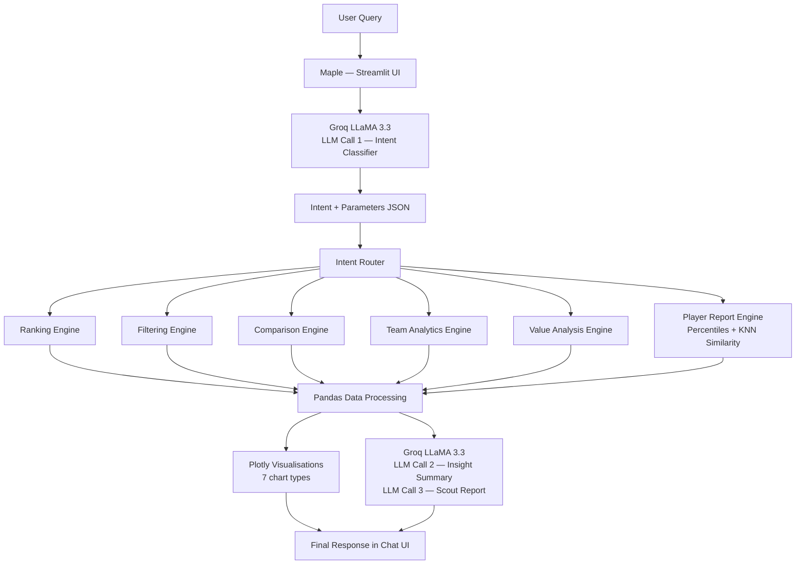
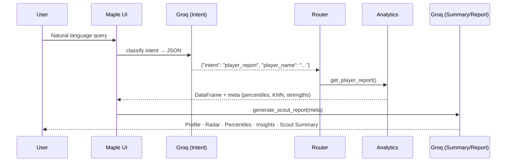

# ⚽ MAPLE

<div align="center">


### Match & Athlete Performance and League Evaluator

*AI-Powered Football Scout Assistant · FIFA World Cup 2026 Edition*

🎥 **Demo:** https://www.loom.com/share/45da6788665741e2a6a1594ca03d4e51

</div>

---

## Overview

**Maple** is an AI-powered football scouting assistant built on FIFA player data and the Groq LLaMA 3.3 70B model. Named after the official mascot of **FIFA World Cup 2026** (hosted in Canada), Maple lets you ask natural language questions and receive structured insights, rankings, comparisons, detailed player reports, and interactive visualisations — no spreadsheets needed.

```text
Show me the top 10 players by overall rating
Compare Messi and Ronaldo
Find the best young players under 23
Generate a scouting report for Kylian Mbappe
Which clubs have the highest average rating?
Show me the best strikers with pace above 85
```

---

## System Architecture



---

## Features

### 📊 Player Rankings
- Top-rated players overall or by position
- Sorted by overall rating, potential, or any stat

### 🌟 Talent Discovery
- Best players under a given age
- Wonderkid identification sorted by potential
- Future stars analysis

### ⚔️ Player Comparison
Head-to-head comparison across 8 attributes with a radar chart:
Overall · Potential · Pace · Shooting · Passing · Dribbling · Defending · Physicality

### 🔍 Advanced Filtering
Filter by any combination of: Age · Position · Nationality · Club · Overall rating · Potential · Pace · Shooting · Passing

### 🏟️ Team Analytics
Highest-rated clubs · Average squad ratings · Team-level aggregation

### 💎 Hidden Gems / Value Analysis
Identifies undervalued players using a custom value score:
```
Value Score = (Overall + Potential) / Market Value × 1,000,000
```

### 📋 Player Performance Report *(flagship feature)*
Full scouting report for any player, triggered by:
```text
Generate a scouting report for Kylian Mbappe
Analyze Lionel Messi
Scout Jude Bellingham
```

The report includes:

| Section | Detail |
|---|---|
| **Player Profile** | Name, Age, Club, Nationality, Position, Overall, Potential, Market Value, Wage |
| **Attribute Radar** | Filled spider chart across 6 skill dimensions |
| **League Percentiles** | Colour-coded bars — how the player ranks vs. the full dataset |
| **Strengths** | Auto-detected attributes in the top 25% (≥ 75th percentile) |
| **Areas for Improvement** | Attributes below the 50th percentile |
| **Similar Players** | 5 most statistically similar players via KNN on 6 skill stats (scoped to same position) |
| **AI Scout Summary** | 3–4 sentence professional scouting paragraph grounded in the data |

---

## Query Processing Pipeline



---

## Tech Stack

| Layer | Technology |
|---|---|
| Frontend | Streamlit (dark theme, custom CSS) |
| LLM | Groq — LLaMA 3.3 70B Versatile |
| Intent classification | Groq · `temperature=0.1` · `max_tokens=300` |
| Insight generation | Groq · `temperature=0.3` · `max_tokens=200` |
| Scout report | Groq · `temperature=0.4` · `max_tokens=250` |
| Data processing | Pandas |
| Similarity search | scikit-learn `NearestNeighbors` + `StandardScaler` |
| Visualisations | Plotly (7 chart types) |
| Package manager | uv |
| Dataset | FIFA 23 Player Dataset (Kaggle) or custom CSV |

---

## Dataset

### Supported Input
- **Built-in sample:** 603-player dataset generated by `generate_sample_data.py`
- **Upload your own:** any FIFA-style CSV via the sidebar uploader
- **Recommended:** [FIFA 23 Complete Player Dataset](https://www.kaggle.com/datasets/stefanoleone992/fifa-23-complete-player-dataset) — 18 000+ real players

### Required Columns
| Category | Fields |
|---|---|
| Player Info | `player_name`, `age`, `nationality`, `club`, `position` |
| Ratings | `overall`, `potential` |
| Financial | `value_eur`, `wage_eur` |
| Skills | `pace`, `shooting`, `passing`, `dribbling`, `defending`, `physicality` |

> The data loader also accepts Kaggle column aliases (`short_name`, `club_name`, `physic`, `player_positions`, etc.) and normalises them automatically.

---

## Project Structure

```text
fifa_scout/
├── app.py                    Main Streamlit app (~720 lines)
├── pyproject.toml            uv project config & dependencies
├── requirements.txt          pip fallback
├── uv.lock                   Pinned lockfile (62 packages)
├── generate_sample_data.py   Generates the bundled sample CSV
├── .env                      GROQ_API_KEY (git-ignored)
├── .gitignore
│
├── data/
│   └── fifa_players.csv      Default 603-player sample dataset
│
├── src/
│   ├── data_loader.py        CSV ingestion, column aliasing, cleaning
│   ├── query_parser.py       LLM call #1 — classifies 8 intents
│   ├── intent_router.py      Dispatches intent → analytics function
│   ├── analytics.py          8 Pandas analytics functions
│   ├── llm_service.py        LLM calls #2 & #3 — summary + scout report
│   ├── visualization.py      7 Plotly chart builders
│   └── utils.py              Example queries + sanitize helper
│
└── .streamlit/
    ├── config.toml           Dark theme + server settings
    └── secrets.toml.example  Template for Streamlit secrets
```

---

## Local Setup

### 1. Clone

```bash
git clone https://github.com/Ananyaa00051/Maple---FIFA-analysis-assistant
cd Maple---FIFA-analysis-assistant/fifa_scout
```

### 2. Install dependencies

**With uv (recommended):**
```bash
# Install uv if you don't have it
pip install uv

uv sync          # installs all dependencies from uv.lock
```

**With pip:**
```bash
pip install -r requirements.txt
```

### 3. Configure API key

Create a `.env` file in the `fifa_scout/` directory:
```env
GROQ_API_KEY=your_groq_api_key_here
```

Get a free key at [console.groq.com](https://console.groq.com).

### 4. Run

```bash
# With uv
uv run streamlit run app.py

# With activated venv
.venv\Scripts\activate      # Windows
streamlit run app.py
```

Opens at **http://localhost:8501**

---

## Using the App

### Data Source
Select your dataset from the sidebar:
- **📦 Use sample dataset** — loads the built-in 603-player CSV instantly
- **⬆️ Upload CSV** — drag and drop any FIFA-format CSV

### Player Report Quick-Launch
The sidebar **📋 Player Reports** panel lets you pick any player from a dropdown and click **Generate Scouting Report** without typing.

### Chat Queries
Type any natural language question or click one of the example query buttons.

---

## How the AI Works

The Groq LLM is used **three times** per player report, **twice** for all other queries:

| Call | Purpose | Model config |
|---|---|---|
| **#1 — Intent classifier** | Converts user query → structured JSON intent | `temp=0.1`, `max_tokens=300` |
| **#2 — Insight summary** | 3-bullet summary of analytics results | `temp=0.3`, `max_tokens=200` |
| **#3 — Scout report** | Professional 3–4 sentence scout paragraph | `temp=0.4`, `max_tokens=250` |

All analytics and calculations run **locally on the dataset using Pandas** — the LLM never answers football questions directly.

---

## Supported Intents

| Intent | Example query |
|---|---|
| `top_players` | "Show me the top 10 players" |
| `young_players` | "Best players under 23" |
| `compare_players` | "Compare Messi and Ronaldo" |
| `filter_players` | "Strikers with pace above 85" |
| `team_analysis` | "Which clubs have the highest average rating?" |
| `value_analysis` | "Best value players / hidden gems" |
| `potential_analysis` | "Players with potential above 90" |
| `player_report` | "Generate a scouting report for Mbappé" |

---

## Limitations

- No live or real-time football data — results depend on the loaded CSV
- Player name matching uses substring search; very uncommon names may not be found
- GK skill stats (pace, shooting, etc.) are often `0` in FIFA data — percentiles reflect this
- KNN similarity is position-scoped when ≥10 players share a position, otherwise full dataset

---

<div align="center">

### Built with ⚽ + 📊 + 🤖

**MAPLE** — Football Intelligence Powered by Data & AI

*FIFA World Cup 2026 · Canada · Named after the official mascot*

</div>
