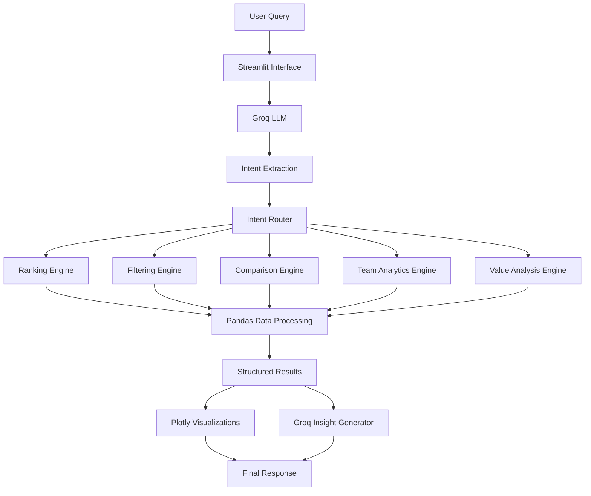
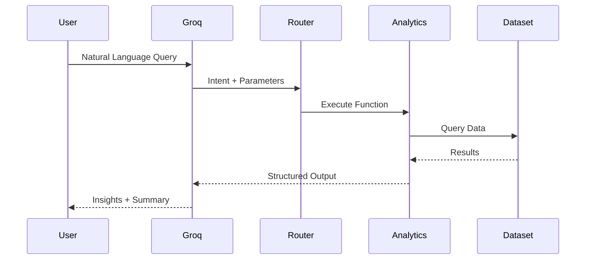

# ⚽ MAPLE

<div align="center">


### Match & Athlete Performance and League Evaluator

*AI-Powered Football Analytics Assistant*

🎥 **Demo:** https://www.loom.com/share/c205efeffc9b491aafdbe60bd72e7953

</div>

---

## Overview

MAPLE is an AI-powered football analytics assistant built using FIFA player data and Groq LLM.

Instead of manually filtering spreadsheets, users can ask questions in natural language and receive structured insights, rankings, comparisons, and visualizations.

Examples:

```text
Show me the top 10 players by overall rating

Compare Messi and Ronaldo

Find the best young players under 23

Which clubs have the highest average rating?

Show me the best strikers with pace above 85
```

---

# System Architecture



---

# Query Processing Pipeline



---

# Features

### Player Rankings

* Top-rated players
* Best players by position
* Highest potential players

### Talent Discovery

* Best players under a given age
* Wonderkid identification
* Future stars analysis

### Player Comparison

Compare any two players across:

* Overall Rating
* Potential
* Pace
* Shooting
* Passing
* Dribbling
* Defending
* Physicality

### Advanced Filtering

Filter players by:

* Age
* Position
* Nationality
* Club
* Rating
* Potential
* Pace
* Passing
* Shooting

### Team Analytics

* Highest-rated clubs
* Average club ratings
* Team-level aggregation

### Hidden Gems

Identify undervalued players using custom value metrics.

---

# Example Workflow

### User Query

```text
Show me the best strikers with pace above 85
```

### Intent Extracted

```json
{
  "intent": "filter_players",
  "position": "ST",
  "pace_min": 85
}
```

### Analytics Engine

```python
filtered = df[
    (df["position"] == "ST")
    & (df["pace"] > 85)
]

filtered.sort_values(
    by="overall",
    ascending=False
)
```

### Response

✅ Ranked Table

✅ Interactive Chart

✅ AI Insight Summary

---

# Tech Stack

| Layer           | Technology             |
| --------------- | ---------------------- |
| Frontend        | Streamlit              |
| LLM             | Groq (Llama 3.3 70B)   |
| Data Processing | Pandas                 |
| Visualizations  | Plotly                 |
| Backend         | Python                 |
| Dataset         | FIFA 23 Player Dataset |

---

# Dataset

### FIFA 23 Complete Player Dataset

Key Attributes:

| Category    | Fields                       |
| ----------- | ---------------------------- |
| Player Info | Name, Age, Nationality, Club |
| Ratings     | Overall, Potential           |
| Financial   | Value, Wage                  |
| Performance | Pace, Shooting, Passing      |
| Technical   | Dribbling, Defending         |
| Physical    | Physicality                  |

---

# Project Structure

```text
maple/
│
├── app.py
├── requirements.txt
├── README.md
│
├── data/
│   └── fifa_players.csv
│
├── src/
│   ├── analytics.py
│   ├── query_parser.py
│   ├── intent_router.py
│   ├── llm_service.py
│   ├── visualization.py
│   └── data_loader.py
│
├── screenshots/
└── assets/
```

---

# Local Setup

### Clone Repository

```bash
git clone <repo-url>
cd maple
```

### Install Dependencies

```bash
pip install -r requirements.txt
```

### Configure Environment

```env
GROQ_API_KEY=your_api_key
```

### Run

```bash
streamlit run app.py
```

---

# AI Usage

The Groq LLM is used for:

* Intent Classification
* Parameter Extraction
* Query Understanding
* Insight Generation
* Result Summarization

All analytics and calculations are executed directly on the FIFA dataset using Pandas.

---

# Screenshots

| Rankings       | Comparison     |
| -------------- | -------------- |
| Add Screenshot | Add Screenshot |

| Team Analytics |
| -------------- |
| Add Screenshot |

---

# Limitations

* Works only with the provided FIFA dataset
* No live football statistics
* Limited to implemented analytics functions
* Requires valid player names for comparison queries

---

<div align="center">

### Built with ⚽ + 📊 + 🤖

MAPLE — Football Intelligence Powered by Data & AI

</div>
