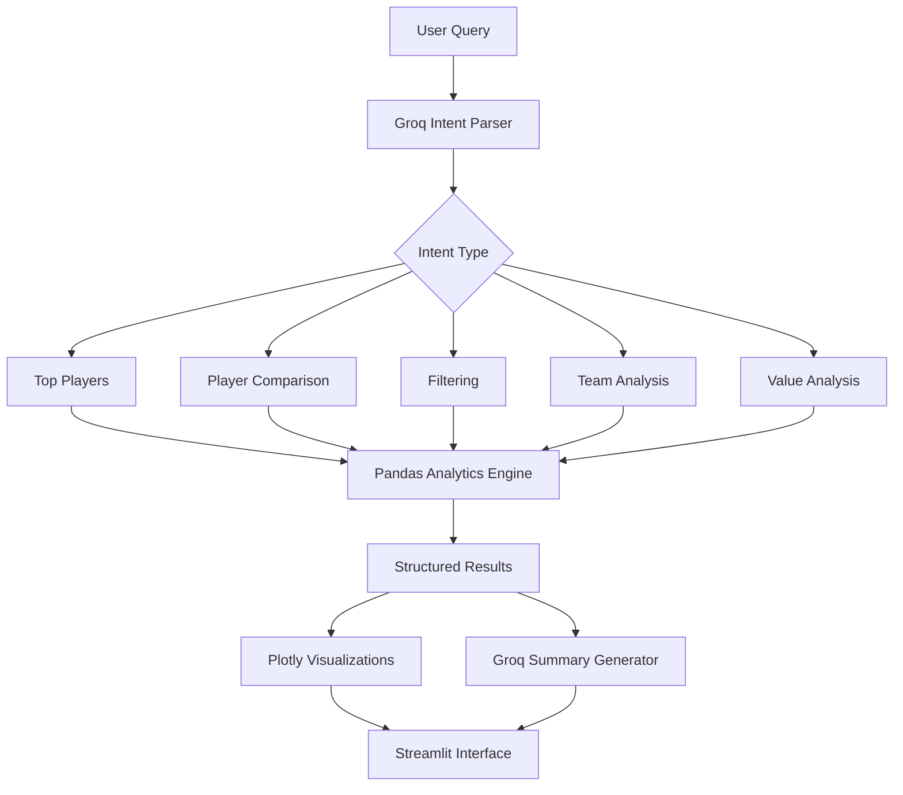
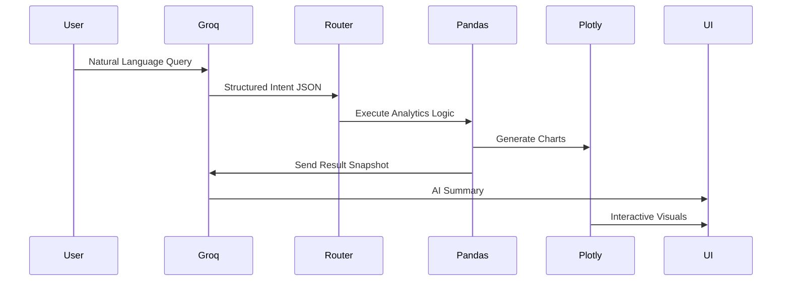

<div align="center">

# ⚽ MAPLE

### Match & Athlete Performance and League Evaluator

**AI-Powered Football Analytics Assistant**

Natural language football analytics powered by **Groq**, **LLaMA 3.3**, **Pandas**, and **Streamlit**

<br>


<br>

*"Ask football questions in plain English. Get data-backed answers instantly."*

</div>

---

## 🚀 Overview

MAPLE is an AI-powered football analytics assistant that allows users to explore FIFA player and team data using natural language.

Instead of manually filtering spreadsheets, users can ask questions such as:

```text
Show me the top 10 players by overall rating
Compare Messi and Ronaldo
Find the best players under age 23
Which clubs have the highest average rating?
Show me strikers with pace above 85
```

The system converts these questions into structured analytics queries, executes them using Pandas, visualizes results with Plotly, and generates concise insights using Groq's LLaMA 3.3 model.

---

## ✨ Features

| Capability                | Description                                       |
| ------------------------- | ------------------------------------------------- |
| 🏆 Top Players            | Rank players globally or by position              |
| 🌱 Young Talent Discovery | Find rising stars by age and potential            |
| ⚔️ Player Comparison      | Compare two players side-by-side                  |
| 🎯 Advanced Filtering     | Filter by pace, nationality, club, position, etc. |
| 🏟️ Team Analysis         | Rank clubs by average overall or potential        |
| 💎 Hidden Gems            | Discover undervalued players                      |
| 🚀 Future Stars           | Find high-potential prospects                     |
| 🤖 AI Insights            | Groq-generated summaries for every result         |
| 📊 Interactive Charts     | Plotly-powered visual analytics                   |

---

## 🧠 System Architecture



---

## ⚙️ Technology Stack

| Layer           | Technology               |
| --------------- | ------------------------ |
| Frontend        | Streamlit                |
| Data Processing | Pandas, NumPy            |
| AI Model        | Groq LLaMA 3.3 70B       |
| Visualizations  | Plotly                   |
| Environment     | Python 3.11+             |
| Package Manager | uv                       |
| Dataset         | FIFA 23 Complete Dataset |

---

## 📦 Dataset

### FIFA 23 Complete Player Dataset

Expected columns:

```text
player_name
age
nationality
club
position
overall
potential
value_eur
wage_eur
pace
shooting
passing
dribbling
defending
physicality
```

The loader automatically normalizes common variations:

```text
short_name  → player_name
physic      → physicality
club_name   → club
```

### Generate Test Data

```bash
uv run python generate_sample_data.py
```

Creates a synthetic dataset containing approximately 600 football players for local testing.

---

## 🛠️ Quick Start

### Install Dependencies

```bash
git clone https://github.com/your-username/maple-football-analytics.git

cd fifa_scout

uv sync
```

---

### Add Dataset

```text
fifa_scout/
└── data/
    └── fifa_players.csv
```

Or generate sample data:

```bash
uv run python generate_sample_data.py
```

---

### Configure API Key

Create a `.env` file:

```env
GROQ_API_KEY=your_groq_api_key_here
```

Alternative:

```bash
cp .streamlit/secrets.toml.example .streamlit/secrets.toml
```

Then add your API key.

---

### Launch Application

```bash
uv run streamlit run app.py
```

Open:

```text
http://localhost:8501
```

---

## 💬 Example Queries

```text
Show me top 10 players

Compare Messi and Ronaldo

Best players under 23

Best strikers with pace above 85

Which clubs have the highest average rating?

Best value players

Players with potential above 90

Top 5 goalkeepers

Spanish players with overall above 85

Best midfielders under 25
```

---

## 📊 Analytics Pipeline



---

## 📁 Project Structure

```text
fifa_scout/

├── app.py
├── pyproject.toml
├── requirements.txt
├── uv.lock
├── README.md
├── generate_sample_data.py
│
├── data/
│   └── fifa_players.csv
│
├── src/
│   ├── data_loader.py
│   ├── query_parser.py
│   ├── intent_router.py
│   ├── analytics.py
│   ├── llm_service.py
│   ├── visualization.py
│   └── utils.py
│
└── .streamlit/
    ├── config.toml
    └── secrets.toml.example
```

---

## 🤖 AI Usage

### 1. Intent Classification

The LLM interprets user questions and converts them into structured JSON.

Example:

```json
{
  "intent": "filter_players",
  "position": "ST",
  "pace_min": 85,
  "limit": 10
}
```

The model never directly answers football questions.

---

### 2. Insight Generation

After Pandas generates the results:

* Top rows are sent to Groq
* Strict anti-hallucination prompt is used
* Output limited to 3 concise bullets
* Summary is grounded entirely in returned data

---

## ⚠️ Known Limitations

* Dataset quality directly affects results
* Name matching uses substring search
* Goalkeeper attributes may be incomplete in some FIFA exports
* Hidden gem score can favor very low-value players
* Groq free tier has rate limits
* Dataset is static (not real-time football data)
* Currently supports comparison between exactly 2 players

---

## 📸 Video 

<div style="position: relative; padding-bottom: 41.5625%; height: 0;"><iframe src="https://www.loom.com/embed/c205efeffc9b491aafdbe60bd72e7953" frameborder="0" webkitallowfullscreen mozallowfullscreen allowfullscreen style="position: absolute; top: 0; left: 0; width: 100%; height: 100%;"></iframe></div>


```

---

<div align="center">

### ⚽ Built with Data, AI, and Football Analytics

**MAPLE — Match & Athlete Performance and League Evaluator**

Powered by Groq • Streamlit • Pandas • Plotly

</div>
